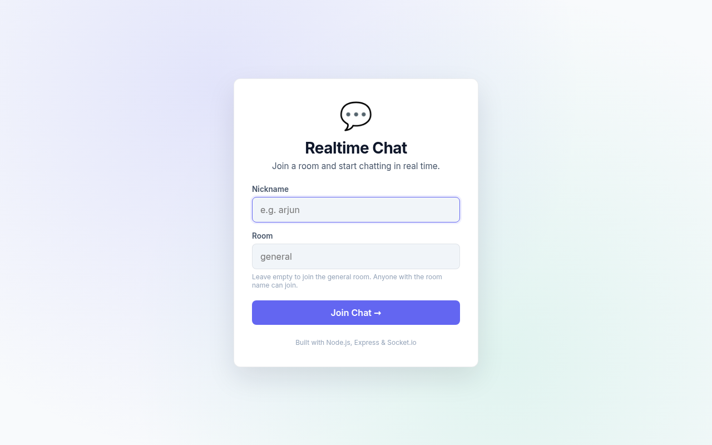
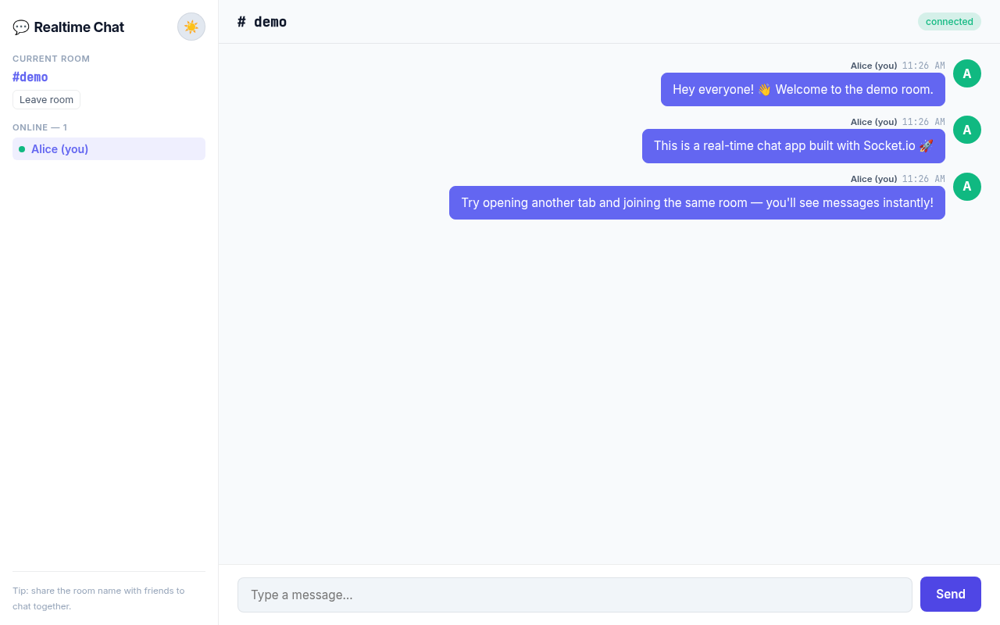

# Realtime Chat

> A real-time chat application with multiple rooms, nicknames, typing indicators, and an online user list — built with **Node.js, Express, and Socket.io**.


## ✨ Features

- **Multiple chat rooms** — join any room by name; share the name with friends to chat together
- **Nicknames** — no account needed; just enter a name and start chatting
- **Real-time messaging** — instant message delivery via WebSockets (Socket.io)
- **Typing indicators** — see when others are typing in real time
- **Online user list** — see who's currently in the room
- **System messages** — automatic "user joined / left" notifications
- **Connection status** — visual indicator of socket connection state
- **Auto-reconnect** — reconnects automatically if the connection drops
- **Dark / light theme** — auto-detects system preference, remembers your choice
- **Responsive design** — works on desktop and mobile

## 📸 Screenshots

**Join screen** — pick a nickname and room name:



**Chat room** — real-time messages, online users, typing indicators:



## 🚀 Live Demo

This app requires a backend server (it can't run on GitHub Pages because Pages only serves static files). Deploy it to any Node.js host:

- **Render** (recommended, free tier) — see deployment instructions below
- **Railway**, **Fly.io**, **Vercel** (with adapter), **Heroku**, **DigitalOcean App Platform**

## 📦 Run Locally

Requirements: **Node.js 18+**

```bash
git clone https://github.com/arjundroid12/realtime-chat.git
cd realtime-chat
npm install
npm start
# Visit http://localhost:3000
```

For development with auto-reload on file changes:

```bash
npm run dev
```

## 🛠️ Tech Stack

| Layer    | Tech                 |
|----------|----------------------|
| Runtime  | Node.js 18+          |
| Server   | Express 4            |
| Realtime | Socket.io 4          |
| Frontend | Vanilla HTML/CSS/JS  |
| Fonts    | Inter, JetBrains Mono |

## 📡 API & Events

### HTTP endpoints

| Method | Path     | Description                          |
|--------|----------|--------------------------------------|
| `GET`  | `/`      | Serves the chat frontend             |
| `GET`  | `/health`| Health check JSON (uptime, users, rooms) |

### Socket.io events

**Client → Server:**

| Event           | Payload                       | Description              |
|-----------------|-------------------------------|--------------------------|
| `room:join`     | `{ roomId, nick }`            | Join a room with a nick  |
| `message:send`  | `{ text }`                    | Send a message           |
| `typing:start`  | —                             | Notify typing started    |
| `typing:stop`   | —                             | Notify typing stopped    |

**Server → Client:**

| Event            | Payload                                             | Description              |
|------------------|-----------------------------------------------------|--------------------------|
| `message:new`    | `{ id, userId, nick, text, ts, system }`            | New message              |
| `user:joined`    | `{ id, nick, ts }`                                  | User joined the room     |
| `user:left`      | `{ id, nick, ts }`                                  | User left the room       |
| `room:users`     | `{ users: [{ id, nick }] }`                         | Updated user list        |
| `typing:update`  | `{ id, nick, typing }`                              | Typing state change      |

## 🚢 Deploy to Render (free tier)

1. Push this repo to GitHub (already done if you're reading this on GitHub!)
2. Go to https://render.com and sign in with GitHub
3. **New +** → **Web Service** → select this repo
4. Configure:
   - **Name**: `realtime-chat` (or anything you like)
   - **Runtime**: Node
   - **Build Command**: `npm install`
   - **Start Command**: `npm start`
   - **Instance Type**: Free
5. **Create Web Service**
6. Wait ~1-2 min for build & deploy. Render will give you a URL like `https://realtime-chat-xxxx.onrender.com`

### Other deployment options

- **Railway**: `railway up` from the project root
- **Fly.io**: `fly launch` then `fly deploy`
- **Heroku**: `heroku create && git push heroku main`

## 🧪 CI/CD

GitHub Actions workflow (`.github/workflows/ci.yml`) on every push and PR:

- Installs dependencies
- Runs `node --check` syntax validation on `src/server.js`
- Runs `npm test` (smoke test that imports the server module)
- Caches `~/.npm` for faster runs

## 📁 Project Structure

```
realtime-chat/
├── .github/
│   └── workflows/
│       └── ci.yml
├── docs/                    # README screenshots
│   ├── screenshot-join.png
│   └── screenshot-chat.png
├── public/                  # Static frontend served by Express
│   ├── app.js               # Client-side Socket.io logic
│   ├── index.html           # Chat UI shell
│   └── styles.css           # Theme, layout, components
├── src/
│   └── server.js            # Express + Socket.io server
├── package.json
├── LICENSE
├── README.md
└── .gitignore
```

## 🔒 Security Notes

- All messages are sanitized on both client (HTML escape) and server (length cap, type check)
- Maximum message length: 1000 characters (server-enforced)
- Maximum nickname length: 30 characters
- Maximum room name length: 50 characters
- Nicknames and room names are sanitized (non-alphanumeric chars replaced with `-`)
- No persistent storage — messages exist only in memory for the duration of the connection
- No authentication — anyone with the room name can join. Don't share sensitive info.

## 🗺️ Roadmap

Ideas for future enhancements:

- [ ] Persistent message history (Redis or SQLite)
- [ ] User authentication (GitHub OAuth)
- [ ] Private direct messages
- [ ] File & image sharing
- [ ] Emoji picker
- [ ] Message reactions
- [ ] Multi-room sidebar (subscribe to several rooms at once)

## 📄 License

[MIT](./LICENSE) © Arjun Vashishtha
